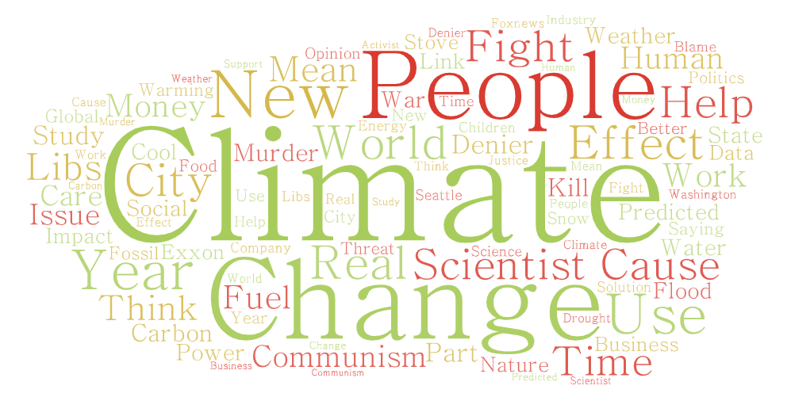
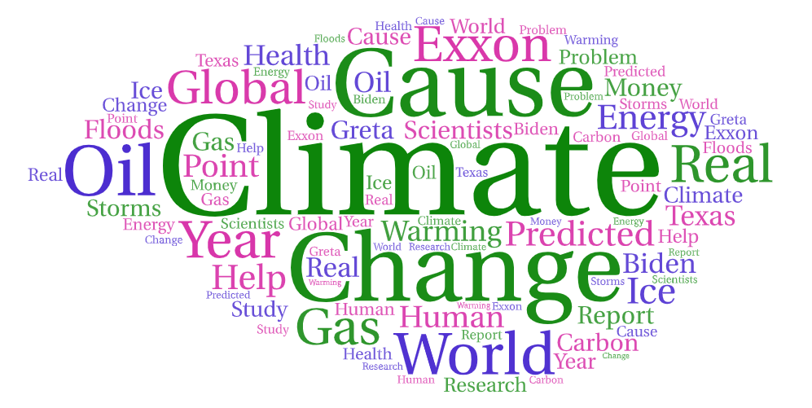
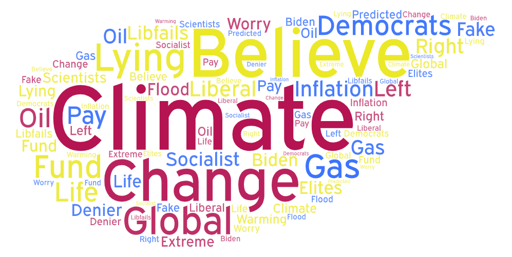

# Lab 2: Geo-tagged tweet collection and visualization
## Mitchell Stapelman 
## GEOG 458

# Narrative

This project is centered around the topic of climate change in the United States, using public discussions about the matter using tweets from Twitter to gauge public opinion and their beliefs. To narrow down these tweets, I searched for tweets that included climate change and global warming, using three US cities (25mi buffer):
- Seattle, WA
- Houston, TX
- Oklahoma City, OK

I wanted to make this comparison to better understand how different states across the US perceive the issue. This data contextualizes the topic by seeing how different cities in different regions of the US talk about climate change and what is used to describe the matter as well. 

## Wordclouds
- ### Seattle

- ### Houston

- ### Oklahoma City

## Analysis
Using Seattle as the baseline for a majority left-leaning cities, Houston as a Southern middle-ground city and Oklahoma City as a primarily right-leaning city, we can see the different ways and the amount that the topic of climate change is discussed online. The most notable similarities between the different clouds are the reoccurring world/global terms and also words relating to science or scientists, denial and effects like flooding or warming. Important differences include changes in patterns for each city, with Seattle focusing more on the effects of climate change and different types of energy while Houston has an emphasis on ExxonMobil or oil and gas in general. Oklahoma City has more discussion around the political left/democrats, as well as key words like 'denier' or 'lying'. 

Some explanations around these word patterns is the **political** and **socio-economic** divide surrounding the climate change debate. Different parts of the US have a dramatically different political make-up, and also are reliant on different types of energy for their economy and power. Cities like Seattle have a larger focus and availability of renewable energy sources like [hydroelectricity](https://www.seattle.gov/city-light/energy-and-environment#:~:text=Over%2080%25%20of%20the%20power,Skagit%20and%20Pend%20Oreille%20Rivers.) while states like Texas have economies that are reliant on oil/gas production. States that are more reliant on nonrenewable energy sources, and whose labor force often occupies a large amount of these jobs trend to the political right, while coastal states and large urban cities or locations where oil/gas isn't the backbone of the economy often [tend to be more left-leaning.](https://www.pewresearch.org/fact-tank/2014/08/08/chart-of-the-week-the-most-liberal-and-conservative-big-cities/)

## Potential Improvements
Some key components of this analysis that can be improved upon is expanding the search to outside of urban centers and cities to allow for representative demographics between urban and rural posts. Expanding this analysis to outside of the US would also provide valuable insight into how other countries perceive climate change based on their geolocation. It is also important to increase the sample size of the data to get a more accurate understanding of each location, rather than simply capturing a vocal minority, which can be done by expanding the search radius beyond 25-30mi, which would be an absolute necessity for nonurban areas.

## Unexpected Outcomes
From the data, I had expected areas like Texas to be more directly similar to right-leaning areas such as Oklahoma. Instead, most debate around climate change revolved around oil and gas companies and energy rather than the validity behind the science. 

[Dataset 1 - Seattle](assets/twsearch-result-1.csv)

[Dataset 2 - Houston](assets/twsearch-result-2.csv)

[Dataset 3 - Oklahoma City](assets/twsearch-result-3.csv)

